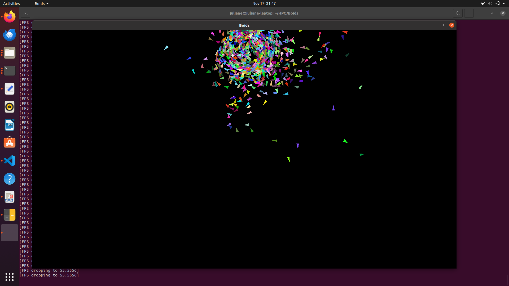
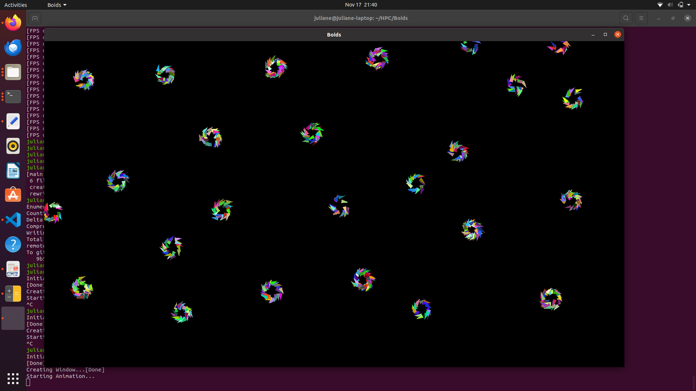
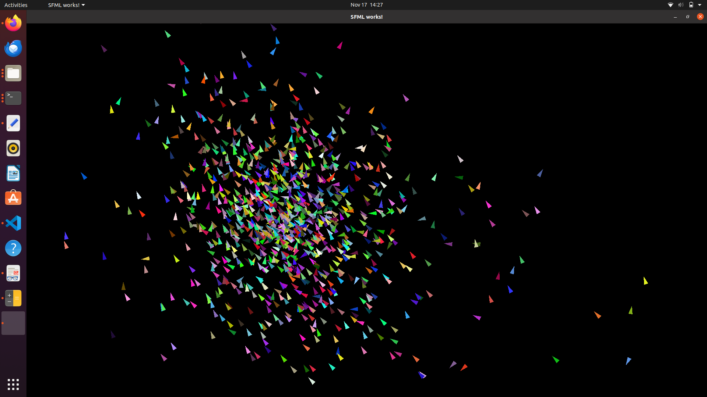

# Boids  
Implementation of Boids in C++ using SFML for graphics and Boost for command line parsing. 

Boids is a simple simulation of flock/swarm-like behavior. Every fish wants to do three things:
  
- Cohesion: Fish wants to swim towards the center of all surrounding fishes  
- Alignment: Fish wants to align himself with the direction of all surrounding fishes   
- Seperation: Fish doesn't want to collide with other fishes   

Also necessary: 

- Push fishes away from the border of the screen, otherwise they disappear   
  
This is a problem, because it kind of forces the fishes to congregate around the borders. 
   
Together with many other fishes this causes natural-looking patterns. I added some constraints to make the movements look more natural:  
  
- max speed  
- max turn angle  
  
I still have to test a lot and want to parallelize it, so that more fishes can be simulated without dropping framerate (right now, about 1000 fishes can be done at 60fps). 
The radius search can be optimized too. Right now, I just iterate over all other fishes (O(n^2)) because I'm unsure which data structure would be most advantageous for constantly changing data.  
  


## Usage  
   
Install SFML and Boost if necessary, then do:

```
cmake .
make
```

This generates the executable boids. You can set the different parameters using the command line like this for example: 

```
./boids --n 1000 --radius 500 --alignment 1 --seperation 1 --cohesion 10
```
This generates n=1000 fishes, that have a visible area of 500. Alignment and seperation forces are weighted as 1, while cohesion is weighted as 10. 

All available options can be seen with the --help option.  
```
Allowed options:
  --help                         produce help message
  --n arg (=1000)                Number of birds/fishes.
  --cohesion arg (=1000)         Weight of cohesion vector.
  --seperation arg (=1)          Weight of seperation vector.
  --alignment arg (=1)           Weight of alignment vector.
  --radius arg (=500)            Radius for fishes that influence cohesion and 
                                 alignment.
  --radius_seperation arg (=300) Radius for fishes that influence seperation.
  --max_x arg (=1600)            Size x-axis of graphics window.
  --max_y arg (=900)             Size y-axis of graphics window.
  --width_tail arg (=10)         Width of tail of bird graphics.
  --length_bird arg (=20)        Length of bird graphics.
  --fps arg (=60)                Desired FPS.
```


## Images  
   
Kind of turned out more like a particle simulation. This is typical behavior, which is kind of black hole-y. In motion it looks kind of 3D. 
Can be achieved with: 
```
./boids --radius 500 --radius_seperation 10
```



When you really reduce the radius to 100, then these small black holes happen and kind of end up as one big black hole, as the different circles run into each other. 
```
./boids --radius 100 --radius_seperation 10 --cohesion 10
```



This is a boring example:


